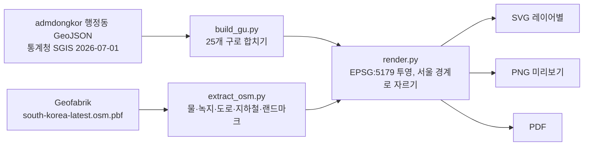

# seoul-map

서울 전체를 담은 A1/A2 벽걸이 포스터. OpenStreetMap 데이터로 그린 벡터(SVG·PDF) 지도이고, 연보라와 회색만 씁니다.

## 현재 상태

- [x] 저장소 생성, 작업 브랜치 `claude/seoul-poster-draft-gurkv4`
- [x] 구 경계 데이터 확보 (통계청 SGIS 기반, 2026-07-01 기준, 25개 구 확인)
- [x] 레이어별 SVG 렌더링 파이프라인 (가로 A2, 지하철 있음/없음 두 버전)
- [x] OSM 데이터 확보: 클라우드 환경에서 OSM 서버가 차단되어 사용자가 Geofabrik 추출본(2026-10-03)을 직접 업로드
- [x] A2 가로 초안 2종 렌더링: [`output/seoul_A2_subway_draft`](output/seoul_A2_subway_draft.png), [`output/seoul_A2_nosubway_draft`](output/seoul_A2_nosubway_draft.png) (각각 .svg/.png/.pdf)
- [x] 한강·다리·산·한글 표기 자동 검수 (아래 "검수" 참고)
- [x] 사용자 검토: **지하철 있는 버전으로 결정** (2026-10-05, 수정 요청 없음)
- [x] 최종본: [`output/seoul_A1_subway.pdf`](output/seoul_A1_subway.pdf) (841×594mm), [`output/seoul_A2_subway.pdf`](output/seoul_A2_subway.pdf) (594×420mm), 각각 .svg와 4000px .png 미리보기 포함

## 실행 방법

```bash
python3 -m pip install -r requirements.txt
# OSM 다운로드가 막혀 있으면 south-korea-latest.osm.pbf 를 data/raw/ 에 직접 넣기
scripts/build.sh A2        # 또는 A1
```

결과물은 `output/seoul_<크기>_<subway|nosubway>[_draft].{svg,png,pdf}` 로 나옵니다.



## 프로젝트 구조

```
seoul-map/
├── README.md
├── requirements.txt
├── scripts/
│   ├── fetch_data.sh     # 구 경계·OSM·폰트(Pretendard) 받기
│   ├── build_gu.py       # 행정동 → 구 경계 합치기
│   ├── extract_osm.py    # pbf에서 포스터용 레이어만 추출
│   ├── render.py         # 레이어별 SVG + PNG + PDF
│   ├── check_accuracy.py # OSM 데이터를 공식 구 경계와 교차 검증
│   └── build.sh          # 전체 파이프라인
├── data/
│   ├── raw/              # 원본 (git 제외, 용량이 큼)
│   └── processed/
│       └── gu.geojson    # 서울 25개 구 경계 (커밋됨)
└── output/               # 포스터 결과물 (초안은 _draft)
```

SVG 레이어 (Inkscape/Illustrator에서 레이어별로 따로 색을 바꿀 수 있음):

```
land → green → water → roads-minor → roads-mid → roads-major → subway → gu-boundaries → labels-gu → labels-landmarks → footer
```

## 설계 결정과 그 이유

### 데이터

| 항목 | 선택 | 이유 |
|---|---|---|
| 도로·물·녹지·지하철 | OpenStreetMap (Geofabrik 일일 추출본) | 프로젝트 요구사항. 공개 라이선스(ODbL)라 포스터에 써도 되고, 출처 표기만 하면 됨 |
| 구 경계 | 통계청 SGIS 행정동 경계 (admdongkor ver20260701) → 구 단위로 합침 | 공식 출처 기반이면서 2026-07-01까지 반영된 최신본. 국가공간정보포털·vworld는 이 환경에서 접속 불가 |
| 지하철 노선 | OSM `railway=subway`, `light_rail` 선로 | 공식 노선도 이미지는 저작권이 있어 따라 그리지 않음. 실제 선로 위치를 데이터로 그림 |
| 랜드마크 위치 | OSM에서 이름으로 찾은 좌표만 사용 | 손으로 좌표를 입력하지 않음. 데이터에 없으면 빼고 경고를 출력 |
| 같은 이름 구분 | 역·버스정류장·상점 태그는 제외, 서울 안쪽, 가장 넓은 면적 우선 | "경복궁"은 역·정류장·식당 이름이기도 하고, "하늘공원"은 고양·노원에도 있음 |

### 디자인

| 항목 | 선택 | 이유 |
|---|---|---|
| 방향 | 가로 (A2 594×420mm 기준, A1은 같은 비율로 확대) | 서울은 동서(약 37km)가 남북(약 30km)보다 길어서 가로가 꽉 차 보임 |
| 투영 | EPSG:5179 (UTM-K) | 한국 공식 좌표계라 서울 모양이 왜곡 없이 나옴. 위경도 그대로 그리면 동서로 약 25% 늘어남 |
| 범위 | 서울 경계 안쪽만 그리고 바깥은 비움 | 도시 모양이 하나의 실루엣으로 보여서 깔끔하고 귀여운 인상 |
| 위계 | 주요도로 0.50mm 진회색 / 보조 0.26mm / 골목 0.10mm 연회색 | 한강과 큰 길이 먼저 보이고 골목은 질감으로만 남게 |
| 지하철 색 | 공식 노선색 대신 진한 보라 한 가지 | "연보라+회색만" 팔레트를 지키기 위해. 노선색 버전이 필요하면 공식색을 채도만 낮춰 추가 가능 |
| 글꼴 | Pretendard (SIL OFL) | 한글이 깔끔하고 무료로 인쇄물에 쓸 수 있음 |
| 라벨 | 25개 구 이름 + 랜드마크 15곳 | 요구사항(구 이름 + 10~20곳). 글자 뒤에 바탕색 테두리를 둘러 도로 위에서도 읽히게 |
| 터널 도로 | 그리지 않음 | 지하라 지상 풍경과 맞지 않고, 남산 등 녹지 위에 선이 생겨 지저분해짐 |
| 지하철 선로 | 지하 구간도 그림 | 서울 지하철은 대부분 지하라 빼면 노선이 끊겨 보임 |
| 녹지·물 | 겹치는 폴리곤을 먼저 합친 뒤 그림 | 북한산국립공원 안의 숲처럼 겹치는 면이 even-odd 채우기에서 서로 지워져 하얗게 비는 문제가 있었음 |
| 라벨 겹침 | 구 이름 → 랜드마크 순으로 상자 충돌 검사, 오른쪽/왼쪽/위/아래 중 빈 곳 선택 | 손으로 위치를 정하지 않고도 겹치지 않게. A1에서 크기가 바뀌어도 다시 계산됨 |
| 산 표시 | 정상은 ▲, 북한산은 국립공원 면적의 서울 안쪽 중심에 라벨 | 백운대 정상은 고양시 쪽이라 서울 지도 밖에 찍힘. 관악산 정상은 과천 경계 위라 300m 여유를 둠 |

| 최종 크기 | A1, A2 두 파일 모두 제공 | 선 굵기·글자가 종이 크기에 비례해서 두 파일은 같은 그림을 확대/축소한 것. 인쇄소에 맞는 크기 파일을 바로 보낼 수 있게 둘 다 뽑음 |
| 인쇄용 파일 | PDF (Pretendard 글꼴 내장) | 인쇄소에서 글꼴이 없어도 똑같이 나옴. PNG는 화면 미리보기용 |

### 팔레트

| 레이어 | 색 |
|---|---|
| 배경 | `#F3F2F5` |
| 서울 땅 | `#FAF9FB` |
| 공원·산 | `#E2DEEA` |
| 물 | `#BCAEDD` |
| 주요도로 | `#5F5C68` |
| 보조도로 | `#AEABB6` |
| 골목 | `#DAD8DF` |
| 지하철 | `#7458B5` |
| 랜드마크 | `#6E56AA` |

## 검수

`python3 scripts/check_accuracy.py` 결과 (OSM 2026-10-03 기준):

| 항목 | 방법 | 결과 |
|---|---|---|
| 한강 곡선 | 강북·강남 구 사이 공식 경계(한강 중심을 따라감)가 OSM 강 폴리곤 안에 있는지 | 28.9km 중 98.0%가 30m 이내 일치 |
| 한강 다리 | OSM에서 강 위를 300m 이상 지나는 다리(보조도로 이상 + 지하철) 묶음 수 | 31개. 서울 한강 교량 수로 흔히 알려진 30개 안팎과 비슷함 (추정 비교) |
| 산 위치·높이 | OSM 정상 노드의 해발 태그 | 백운대 835.6m, 자운봉 740.2m (공표값 836m, 740m) |
| 구 이름 | 공식 데이터 그대로 사용, 25개 확인 | 오타 없음 |
| 랜드마크 이름 | 15개 수동 확인 | 경복궁, N서울타워, 롯데월드타워, 63스퀘어, 동대문디자인플라자, 서울역, 서울숲, 올림픽공원, 여의도공원, 하늘공원, 코엑스, 김포국제공항, 북한산, 관악산, 도봉산 |
